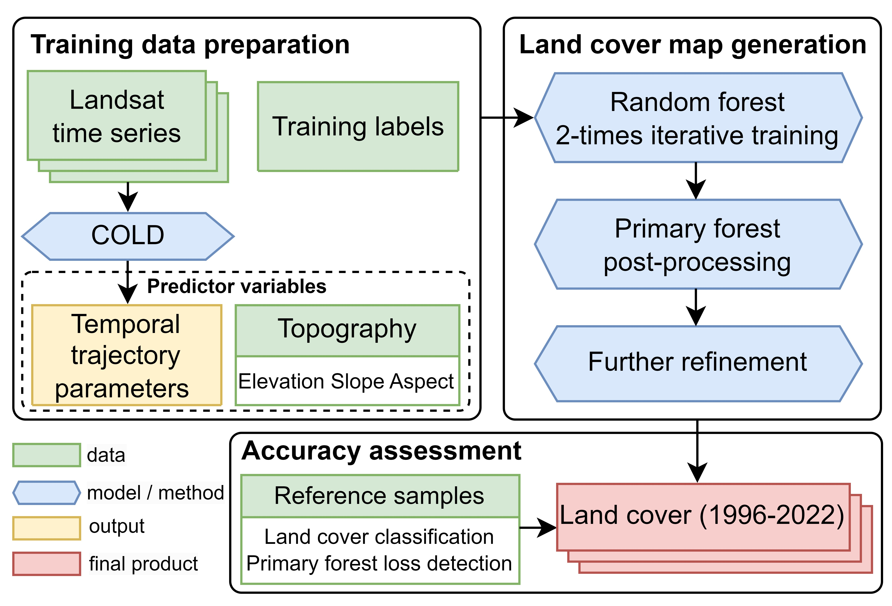
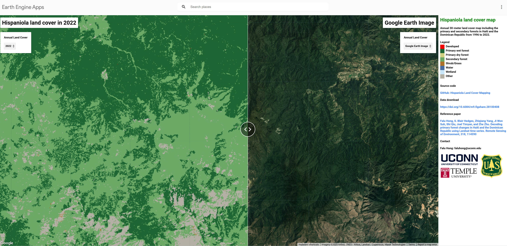

# Workflow of land cover mapping on the Island of Hispaniola to track the primary forest loss
We used the COLD algorithm ([COntinuous monitoring of Land Disturbance](https://www.sciencedirect.com/science/article/pii/S0034425719301002)) 
and Landsat time-series to track the primary forest loss on the Island of Hispaniola (Haiti and the Dominican Republic). 

We generated annual 30-meter land cover map in Haiti and the Dominican Republic from 1996 to 2022.  
The land cover types include: 
(1) Developed 
(2) Primary wet forest 
(3) Primary dry forest
(4) Secondary forest
(5) Shrub/Grass
(6) Water
(7) Wetland
(8) Other

Flowchart of land cover (including primary forest) map generation in Haiti and the Dominican Republic.

  
The generated land cover map can be downloaded from: https://doi.org/10.6084/m9.figshare.28100408

Interactive map are available at Google Earth Engine APP at: https://gers.users.earthengine.app/view/hispaniola-lc

Reference:
Falu Hong, S. Blair Hedges, Zhiqiang Yang, Ji Won Suh, Shi Qiu, Joel Timyan, and Zhe Zhu. [Decoding primary forest changes in Haiti and the Dominican Republic using Landsat time series](https://www.sciencedirect.com/science/article/pii/S0034425724006163). _Remote Sensing of Environment_, 318, 114590
